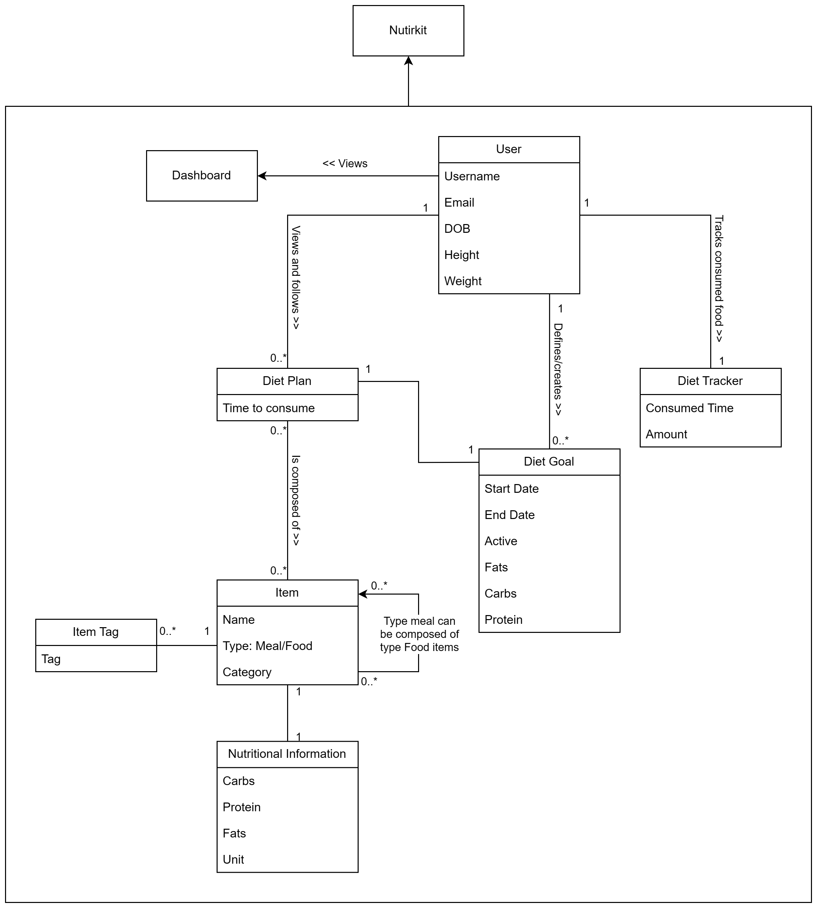
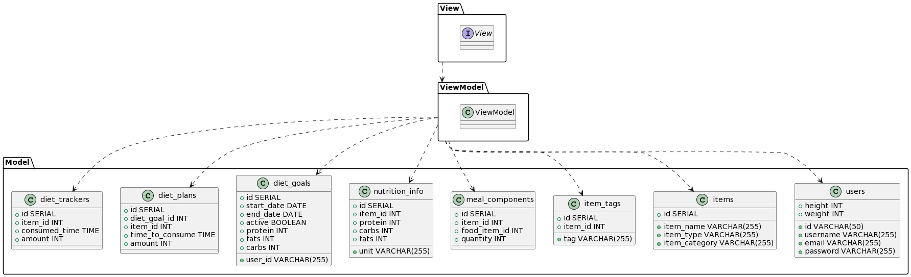
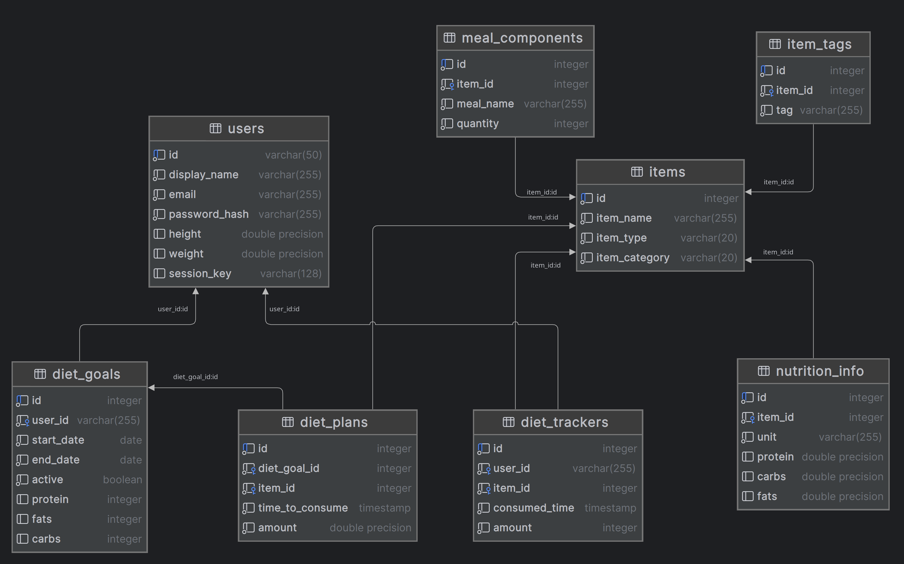
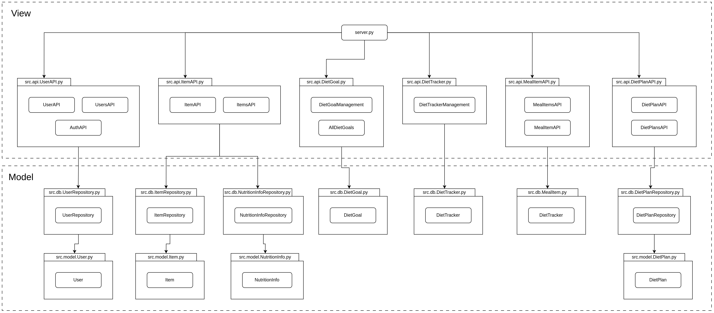

# Nutrikit

## Team 3 Members

1. Abdul Ahad Khan

    ID: ak7160

2. Jheel Nikulkumar Patel

    ID: jp9959

3. Love Jayesh Ahir

    ID: la3679

4. Taha Draoui

    ID: td1522

# Product Description

The project description can be found here on the course schedule page for NutriKit.

## Functionality

1. Can store nutritional information about a Food Item. More Food items can be added through API not exposed in frontend. Which allows Developer to add a new Food item but normal users can’t. Add the food items data is shared by all the users, this is done so normal users can’t produce inaccurate data in the application.

    Currently the app supports the following nutritional information: 

        a. Proteins
        b. Carbohydrates
        c. Fats

    All the values are in grams.

    Each food item can be any one of the following categories:

        a. Proteins
        b. Fruits
        c. Vegetables
        d. Dairy
        e. Grains

2. A user can create a Diet Goal and this will be a daily consumption goal of the above mentioned nutritions. A user can create multiple diet goals and any one of them can be active a time which can be changed by the user.

3. A user can track an item which is consumed by her in the application.

4. A user can also create a diet plan consisting of all the items she can consume in a day to achieve the diet goal.


# Domain Analysis

## Domain Model Diagram



# Architecture

- As was suggested in the course, MVVM architecture was used for the implementation of the product.



## Data View

- It was decided to use a SQL database for persistence and Postgres engine was used. This decision was based on our previous assignments and also the course requirements.



## Implementation View



## API

- Implemented APIs:
    1. Users
    2. Authentication
    3. Food/Meal items
    4. Diet goals
    5. Diet tracker

### Users
1. get /users/\<string:id> \
    Get user details from its ID.\
    Example response body:
    ```json
    {
        "id": "ahad",
        "display_name": "Ahad Khan",
        "email": "ak7160@rit.edu",
        "height": 5.5,
        "weight": null
    }
    ```

2. put /users/\<string:id> \
    Update user details. \
    Example request body:
    ```json
    {
        "email": "UPDATED_EMAIL",
        "display_name": "UPDATED_DISPLAY_NAME",
        "height": "UPDATED_HEIGHT",
        "weight": "UPDATED_WEIGHT",
        "password": "UPDATED_PASSWORD"
    }
    ```
    Note: all above fields are optional and only the updated field/s can be added. \
    Example response body:
    ```json
    {
        "id": "ID",
        "email": "UPDATED_EMAIL",
        "display_name": "UPDATED_DISPLAY_NAME",
        "height": "UPDATED_HEIGHT",
        "weight": "UPDATED_WEIGHT"
    }
    ```

3. post /users \
    Create a new User on registration.
    Eample request body:
    ```json
    {
        "id": "ID",
        "email": "EMAIL",
        "display_name": "DISPLAY_NAME",
        "height": "HEIGHT_IN_FEET (OPTIONAL)",
        "weight": "WEIGHT_IN_KG (OPTIONAL)",
        "password": "PASSWORD"
    }
    ```
    Example response body:
    ```json
    {
        "id": "ahad",
        "display_name": "Ahad Khan",
        "email": "ak7160@rit.edu",
        "height": 5.5,
        "weight": null
    }
    ```

4. delete /users/\<string:id> \
    Delete a user with ID=id.

5. get /users \
    List all the users on the system. \
    Example response body:
    ```json
    [
        {
            "id": "ahad",
            "display_name": "Ahad Khan",
            "email": "ak7160@rit.edu",
            "height": 5.5,
            "weight": null
        },
        {
            "id": "jheel",
            "display_name": "Jheel Patel",
            "email": "jp9959@rit.edu",
            "height": null,
            "weight": null
        }
    ]
    ```

### Authentication
1. post /auth/login \
    User login. Returns an access token for the session. \
    Example request body:
    ```json
    {
        "id": "USER_ID",
        "password": "USER_PASSWORD"
    }
    ```
    Example response body if user logged in successfully:
    ```json
    {
        "message": "User logged in successfully.",
        "type": "INFO",
        "access_token": "SESSION_KEY"

    }
    ```
    Example response body if user login incorrect:
    ```json
    {
        "message": "Incorrect password.",
        "type": "INFO",

    }
    ```

2. post /auth/logout \
    User logout. Session key is reset in backend. \
    Example request body:
    ```json
    {
        "id": "USER_ID"
    }
    ```
    Example response body:
    ```json
    {
        "message": "User logged out successfully.",
        "type": "INFO"
    }
    ```

3. post /auth/check_session
    Check if user is logged in. \
    Example request body:
    ```json
    {
        "id": "jheel",
        "access_token": "SESSION_KEY"
    }
    ```
    Example response body:
    ```json
    {
        "session_active": "TRUE if SESSION_KEY is valid otherwise FALSE",
        "type": "INFO"
    }
    ```

### Items (Food/Meal Items)
1. get /items/\<int:id> \
    Get item details along with its nutritional info for the item id. \
    Example response body:
    ```json
    {
        "id": 3,
        "item_name": "Egg",
        "item_type": "FOOD",
        "item_category": "PROTEIN",
        "item_id": 3,
        "unit": "1",
        "protein": 6,
        "carbs": 0.6,
        "fats": 5
    }
    ```

2. get /items \
    Get list of all the items on the system. \
    Example response body:
    ```json
    [
        {
            "id": 3,
            "item_name": "Egg",
            "item_type": "FOOD",
            "item_category": "PROTEIN",
            "item_id": 3,
            "unit": "1",
            "protein": 6,
            "carbs": 0.6,
            "fats": 5
        },
        {
            "id": 4,
            "item_name": "Apple",
            "item_type": "FOOD",
            "item_category": "CARBOHYDRATES",
            "item_id": 4,
            "unit": "1",
            "protein": 1,
            "carbs": 25,
            "fats": 0
        }
    ]
    ```

3. post /items \
    Add a food/meal item. \
    Example request body:
    ```json
    {
        "item_name": "Egg",
        "item_type": "FOOD",
        "item_category": "PROTEIN",
        "unit": "1",
        "protein": 6,
        "carbohydrates": 0.6,
        "fats": 5
    }
    ```
    Example response body:
    ```json
    {
        "id": 1,
        "item_name": "Egg",
        "item_type": "FOOD",
        "item_category": "PROTEIN",
        "unit": "1",
        "protein": 6,
        "carbohydrates": 0.6,
        "fats": 5
    }
    ```

4. delete /items/\<int:id> \
    Delete an item from the system.


# Enhancements Implemented

1. A user can create multiple diet goals and can have one active diet goal.
2. API and business logic for diet plan autogeneration from the active diet goal.

# Future Implementation

1. A user can add a Meal Item which is composed of multiple Food Items.
2. UI integration for interacting with the diet plan autogeneration feature.